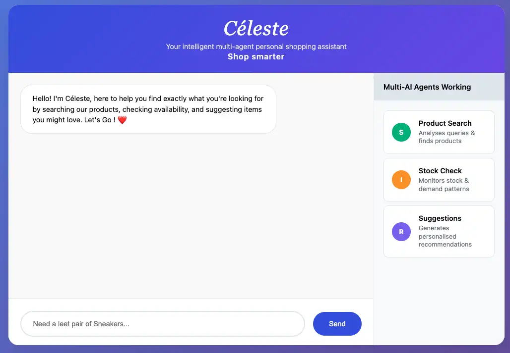

# Céleste - Multi-Agent AI Shopping Assistant

A sophisticated multi-agent AI system built for the **GKE Turns 10 Hackathon**. Céleste demonstrates advanced agentic AI coordination using three specialized agents that collaborate to provide intelligent shopping assistance through natural language conversations.

**Live Demo**: [http://34.54.94.175/home](http://34.54.94.175/home)


## Multi-Agent Architecture

Céleste implements a true agentic AI system where autonomous agents coordinate to solve complex shopping queries:

### Agent Orchestrator
Central coordinator that manages agent communication and synthesizes responses from multiple AI agents working in parallel.

### Search Agent
- Analyzes customer queries using Google Gemini AI
- Performs intelligent product matching against catalog data
- Classifies intent (product search, style advice, price inquiry, etc.)
- Returns ranked product results with relevance scoring

### Inventory Agent
- Simulates real-time stock level checking
- Analyzes demand patterns and trending items
- Provides inventory recommendations and alerts
- Tracks seasonal availability patterns

### Recommendation Agent
- Generates personalized suggestions based on user context
- Maintains conversation history for improved recommendations
- Creates contextual follow-up actions
- Calculates personalization scores for enhanced user experience

## Technology Stack

- **Language**: Go 1.25+ with Gorilla Mux routing
- **AI Engine**: Google Gemini 2.5 Flash for natural language processing
- **Agent Framework**: Custom implementation inspired by Agent Development Kit (ADK) patterns
- **Message Protocol**: MCP-inspired inter-agent communication
- **Deployment**: Google Kubernetes Engine (GKE) Autopilot
- **Container Registry**: Google Artifact Registry
- **Networking**: Kubernetes Ingress with external load balancer

## Features

### Conversational AI Interface
- Natural language product queries with context understanding
- Real-time agent coordination visualization
- Mobile-responsive progressive web interface
- Animated agent activity indicators showing multi-agent workflow

### Intelligent Product Discovery
- Semantic search across product catalogs
- Intent classification and query analysis
- Synonym matching and category-based filtering
- Personalized recommendations based on conversation history

### Real-time Agent Coordination
- Autonomous agent decision-making and task distribution
- Inter-agent message passing and state synchronization
- Workflow visualization showing agent participation
- Graceful error handling and agent fallback mechanisms

## API Endpoints

### GET /
Welcome message and system status

### GET /home
Responsive web interface for interactive agent demonstrations
- **Demo URL**: [http://34.54.94.175/home](http://34.54.94.175/home)

### GET /health
System health monitoring endpoint that returns agent status and availability
- Lists all registered agents (search_agent, inventory_agent, recommendation_agent)
- Reports system health status
- Shows active agent count for monitoring
- **Example**: [http://34.54.94.175/health](http://34.54.94.175/health)

### GET /agents
Agent registry endpoint that lists all available agents and their capabilities
- Returns live agent inventory with names and status
- Shows total agent count
- Useful for debugging and system monitoring
- **Example**: [http://34.54.94.175/agents](http://34.54.94.175/agents)

### POST /chat
Multi-agent query processing endpoint that triggers the full agent workflow
```json
{
  "query": "I need winter boots for hiking",
  "user_id": "demo_user"
}
